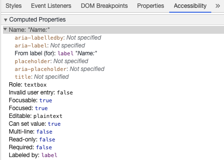
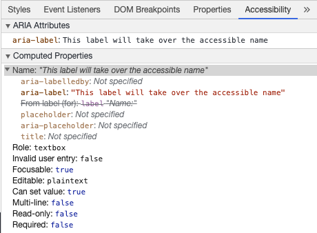
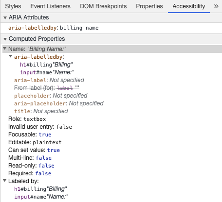
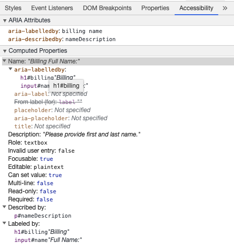
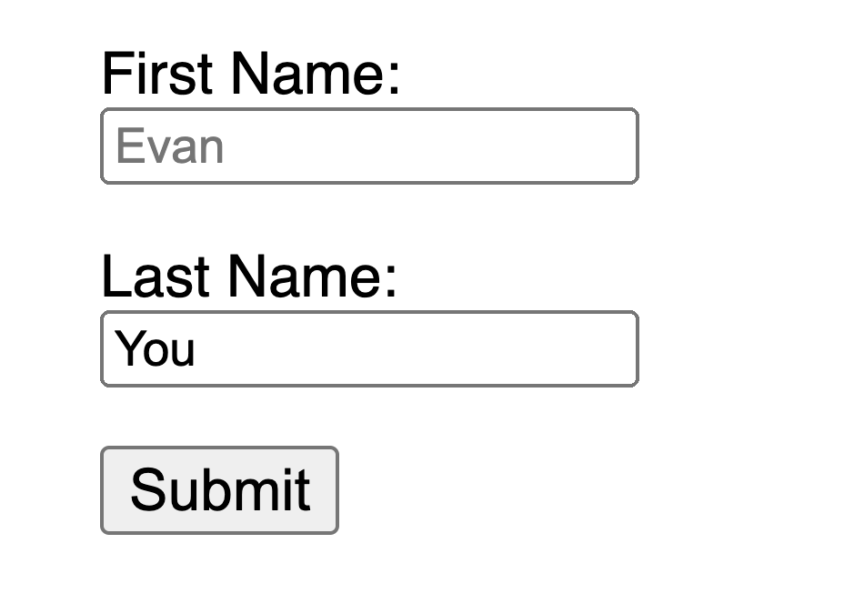

# 无障碍访问 (Accessibility) {#accessibility}

Web 无障碍访问（也称为 a11y）是指创建任何人都可以使用的网站的做法——无论是有残疾的人、连接缓慢的人、使用过时的或损坏的硬件的人，还是仅仅处于不利环境中的人。例如，为视频添加字幕将有助于您的聋哑和听力障碍用户，以及处于嘈杂环境中无法听到手机声音的用户。同样，确保您的文本对比度不会太低将有助于您的低视力用户和试图在明亮阳光下使用手机的用户。

准备好开始但不确定从哪里开始？

查看 [万维网联盟 (W3C)](https://www.w3.org/) 提供的 [Web 无障碍访问规划和管理指南](https://www.w3.org/WAI/planning-and-managing/)

## 跳过链接 (Skip Link) {#skip-link}

您应该在每个页面的顶部添加一个直接跳转到主内容区域的链接，以便用户可以跳过在多个网页上重复的内容。

通常在 `App.tsx` 的顶部完成，因为它将是您所有页面上第一个可聚焦的元素：

```tsx
import { useRef, useEffect } from '@rue-js/rue'
import type { FC } from '@rue-js/rue'

const App: FC = () => {
  const backToTop = useRef<HTMLSpanElement>(null)
  const skipLink = useRef<HTMLAnchorElement>(null)

  return (
    <>
      <span ref={backToTop} tabIndex={-1} />
      <ul className="skip-links">
        <li>
          <a href="#main" ref={skipLink} className="skip-link">
            跳转到主内容
          </a>
        </li>
      </ul>
      {/* ... */}
    </>
  )
}
```

要隐藏链接除非它被聚焦，您可以添加以下样式：

```css
.skip-links {
  list-style: none;
}

.skip-link {
  white-space: nowrap;
  margin: 1em auto;
  top: 0;
  position: fixed;
  left: 50%;
  margin-left: -72px;
  opacity: 0;
}

.skip-link:focus {
  opacity: 1;
  background-color: white;
  padding: 0.5em;
  border: 1px solid black;
}
```

当用户更改路由时，将焦点返回到页面的最开始，就在跳过链接之前。这可以通过在 `backToTop` ref 上调用 focus 来实现（假设使用了 `@rue-js/rue-router`）：

```tsx
import { useEffect, useRef } from '@rue-js/rue'
import { useLocation } from '@rue-js/rue-router'
import type { FC } from '@rue-js/rue'

const App: FC = () => {
  const location = useLocation()
  const backToTop = useRef<HTMLSpanElement>(null)

  useEffect(() => {
    backToTop.current?.focus()
  }, [location.pathname])

  return (
    <>
      <span ref={backToTop} tabIndex={-1} />
      {/* ... */}
    </>
  )
}
```

[阅读关于跳转到主内容的跳过链接文档](https://www.w3.org/WAI/WCAG21/Techniques/general/G1.html)

## 内容结构 (Content Structure) {#content-structure}

无障碍访问最重要的部分之一是确保设计能够支持无障碍实现。设计不仅应考虑颜色对比度、字体选择、文本大小和语言，还应考虑内容在应用中的结构方式。

### 标题 (Headings) {#headings}

用户可以通过标题浏览应用。为应用的每个部分提供描述性标题可以使用户更容易预测每个部分的内容。关于标题，有一些推荐的无障碍访问实践：

- 按等级顺序嵌套标题：`<h1>` - `<h6>`
- 不要在一个部分内跳过标题
- 使用实际的标题标签而不是通过样式文本来赋予标题的视觉外观

[阅读更多关于标题的内容](https://www.w3.org/TR/UNDERSTANDING-WCAG20/navigation-mechanisms-descriptive.html)

```tsx
<main role="main" aria-labelledby="main-title">
  <h1 id="main-title">主标题</h1>
  <section aria-labelledby="section-title-1">
    <h2 id="section-title-1">部分标题</h2>
    <h3>部分副标题</h3>
    {/* 内容 */}
  </section>
  <section aria-labelledby="section-title-2">
    <h2 id="section-title-2">部分标题</h2>
    <h3>部分副标题</h3>
    {/* 内容 */}
    <h3>部分副标题</h3>
    {/* 内容 */}
  </section>
</main>
```

### 地标 (Landmarks) {#landmarks}

[地标](https://developer.mozilla.org/zh-CN/docs/Web/Accessibility/ARIA/Roles/landmark_role) 提供对应用内各部分编程式的访问。依赖辅助技术的用户可以导航到应用的每个部分并跳过内容。您可以使用 [ARIA 角色](https://developer.mozilla.org/zh-CN/docs/Web/Accessibility/ARIA/Roles) 来帮助实现这一点。

| HTML    | ARIA 角色            | 地标用途                                             |
| ------- | -------------------- | ---------------------------------------------------- |
| header  | role="banner"        | 主标题：页面标题                                     |
| nav     | role="navigation"    | 适合在导航文档或相关文档时使用的链接集合             |
| main    | role="main"          | 文档的主要内容或核心内容                             |
| footer  | role="contentinfo"   | 关于父文档的信息：脚注/版权/隐私声明链接             |
| aside   | role="complementary" | 支持主要内容，但分离且本身有意义的内容               |
| search  | role="search"        | 此部分包含应用的搜索功能                             |
| form    | role="form"          | 表单相关元素的集合                                   |
| section | role="region"        | 相关且用户可能希望导航到的内容。必须为此元素提供标签 |

[阅读更多关于地标的内容](https://www.w3.org/TR/wai-aria-1.2/#landmark_roles)

## 语义化表单 (Semantic Forms) {#semantic-forms}

创建表单时，您可以使用以下元素：`<form>`、`<label>`、`<input>`、`<textarea>` 和 `<button>`

标签通常放置在表单字段的上方或左侧：

```tsx
import { useState } from '@rue-js/rue'
import type { FC } from '@rue-js/rue'

interface FormItem {
  id: string
  label: string
  type: string
}

const MyForm: FC = () => {
  const [formItems] = useState<FormItem[]>([
    { id: 'name', label: '姓名', type: 'text' },
    { id: 'email', label: '邮箱', type: 'email' },
  ])
  const [values, setValues] = useState<Record<string, string>>({})

  return (
    <form action="/dataCollectionLocation" method="post" autoComplete="on">
      {formItems.map(item => (
        <div key={item.id} className="form-item">
          <label htmlFor={item.id}>{item.label}: </label>
          <input
            type={item.type}
            id={item.id}
            name={item.id}
            value={values[item.id] || ''}
            onChange={e => setValues(prev => ({ ...prev, [item.id]: e.target.value }))}
          />
        </div>
      ))}
      <button type="submit">提交</button>
    </form>
  )
}
```

请注意，您可以在表单元素上包含 `autoComplete='on'`，它将应用于表单中的所有输入。您还可以为每个输入设置不同的 [自动完成属性值](https://developer.mozilla.org/zh-CN/docs/Web/HTML/Attributes/autocomplete)。

### 标签 (Labels) {#labels}

提供标签以描述所有表单控件的用途；链接 `for` 和 `id`：

```tsx
<label htmlFor="name">姓名: </label>
<input type="text" name="name" id="name" />
```

如果您在 Chrome DevTools 中检查此元素并打开 Elements 选项卡内的 Accessibility 选项卡，您将看到输入如何从标签获取其名称：



:::warning 警告：
尽管您可能见过像这样包裹输入字段的标签：

```tsx
<label>
  姓名:
  <input type="text" name="name" id="name" />
</label>
```

使用匹配的 id 显式设置标签能更好地被辅助技术支持。
:::

#### `aria-label` {#aria-label}

您还可以使用 [`aria-label`](https://developer.mozilla.org/zh-CN/docs/Web/Accessibility/ARIA/Attributes/aria-label) 为输入提供可访问名称。

```tsx
<label htmlFor="name">姓名: </label>
<input
  type="text"
  name="name"
  id="name"
  aria-label={nameLabel}
/>
```

随时在 Chrome DevTools 中检查此元素以查看可访问名称如何变化：



#### `aria-labelledby` {#aria-labelledby}

使用 [`aria-labelledby`](https://developer.mozilla.org/zh-CN/docs/Web/Accessibility/ARIA/Attributes/aria-labelledby) 与 `aria-label` 类似，不同之处在于它在标签文本在屏幕上可见时使用。它通过 `id` 与其他元素配对，您可以链接多个 `id`：

```tsx
<form className="demo" action="/dataCollectionLocation" method="post" autoComplete="on">
  <h1 id="billing">账单</h1>
  <div className="form-item">
    <label htmlFor="name">姓名: </label>
    <input type="text" name="name" id="name" aria-labelledby="billing name" />
  </div>
  <button type="submit">提交</button>
</form>
```



#### `aria-describedby` {#aria-describedby}

[aria-describedby](https://developer.mozilla.org/zh-CN/docs/Web/Accessibility/ARIA/Attributes/aria-describedby) 的使用方式与 `aria-labelledby` 相同，不同之处在于它提供了用户可能需要的额外信息描述。这可用于描述任何输入的条件：

```tsx
<form className="demo" action="/dataCollectionLocation" method="post" autoComplete="on">
  <h1 id="billing">账单</h1>
  <div className="form-item">
    <label htmlFor="name">全名: </label>
    <input
      type="text"
      name="name"
      id="name"
      aria-labelledby="billing name"
      aria-describedby="nameDescription"
    />
    <p id="nameDescription">请提供名字和姓氏。</p>
  </div>
  <button type="submit">提交</button>
</form>
```

您可以通过检查 Chrome DevTools 来查看描述：



### 占位符 (Placeholder) {#placeholder}

避免使用占位符，因为它们可能会让许多用户感到困惑。

占位符的问题之一是它们默认不符合 [颜色对比度标准](https://www.w3.org/WAI/WCAG21/Understanding/contrast-minimum.html)；修复颜色对比度会使占位符看起来像输入字段中预填充的数据。查看以下示例，您可以看到符合颜色对比度标准的 Last Name 占位符看起来像预填充的数据：



```tsx
<form className="demo" action="/dataCollectionLocation" method="post" autoComplete="on">
  {formItems.map(item => (
    <div key={item.id} className="form-item">
      <label htmlFor={item.id}>{item.label}: </label>
      <input type="text" id={item.id} name={item.id} placeholder={item.placeholder} />
    </div>
  ))}
  <button type="submit">提交</button>
</form>
```

```css
/* https://www.w3schools.com/howto/howto_css_placeholder.asp */

#lastName::placeholder {
  /* Chrome, Firefox, Opera, Safari 10.1+ */
  color: black;
  opacity: 1; /* Firefox */
}

#lastName:-ms-input-placeholder {
  /* Internet Explorer 10-11 */
  color: black;
}

#lastName::-ms-input-placeholder {
  /* Microsoft Edge */
  color: black;
}
```

最好将所有用户填写表单所需的信息放在任何输入之外。

### 说明 (Instructions) {#instructions}

为输入字段添加说明时，请确保正确链接到输入。
您可以在 [`aria-labelledby`](https://developer.mozilla.org/zh-CN/docs/Web/Accessibility/ARIA/Attributes/aria-labelledby) 内绑定多个 id 以提供额外的说明。这允许更灵活的设计。

```tsx
<fieldset>
  <legend>使用 aria-labelledby</legend>
  <label id="date-label" htmlFor="date">
    当前日期:{' '}
  </label>
  <input type="date" name="date" id="date" aria-labelledby="date-label date-instructions" />
  <p id="date-instructions">MM/DD/YYYY</p>
</fieldset>
```

或者，您可以使用 [`aria-describedby`](https://developer.mozilla.org/zh-CN/docs/Web/Accessibility/ARIA/Attributes/aria-describedby) 将说明附加到输入：

```tsx
<fieldset>
  <legend>使用 aria-describedby</legend>
  <label id="dob" htmlFor="dob">
    出生日期:{' '}
  </label>
  <input type="date" name="dob" id="dob" aria-describedby="dob-instructions" />
  <p id="dob-instructions">MM/DD/YYYY</p>
</fieldset>
```

### 隐藏内容 (Hiding Content) {#hiding-content}

通常不建议视觉隐藏标签，即使输入有可访问名称。但是，如果输入的功能可以通过周围内容理解，那么我们可以隐藏视觉标签。

让我们看看这个搜索字段：

```tsx
<form role="search">
  <label htmlFor="search" className="hidden-visually">
    搜索:{' '}
  </label>
  <input type="text" name="search" id="search" />
  <button type="submit">搜索</button>
</form>
```

我们可以这样做，因为搜索按钮将帮助视觉用户识别输入字段的用途。

我们可以使用 CSS 来视觉隐藏元素但保持它们对辅助技术可用：

```css
.hidden-visually {
  position: absolute;
  overflow: hidden;
  white-space: nowrap;
  margin: 0;
  padding: 0;
  height: 1px;
  width: 1px;
  clip: rect(0 0 0 0);
  clip-path: inset(100%);
}
```

#### `aria-hidden="true"` {#aria-hidden-true}

添加 `aria-hidden="true"` 将对辅助技术隐藏该元素，但对其他用户保持视觉可用。不要在可聚焦元素上使用它，仅在装饰性、重复或屏幕外内容上使用。

```tsx
<p>这对屏幕阅读器不隐藏。</p>
<p aria-hidden="true">这对屏幕阅读器隐藏。</p>
```

### 按钮 (Buttons) {#buttons}

在表单中使用按钮时，您必须设置类型以防止提交表单。
您还可以使用输入来创建按钮：

```tsx
<form action="/dataCollectionLocation" method="post" autoComplete="on">
  {/* 按钮 */}
  <button type="button">取消</button>
  <button type="submit">提交</button>

  {/* 输入按钮 */}
  <input type="button" value="取消" />
  <input type="submit" value="提交" />
</form>
```

### 功能图像 (Functional Images) {#functional-images}

您可以使用此技术来创建功能图像。

- 输入字段
  - 这些图像将在表单上充当提交类型按钮

  ```tsx
  <form role="search">
    <label htmlFor="search" className="hidden-visually">
      搜索:{' '}
    </label>
    <input type="text" name="search" id="search" />
    <input type="image" className="btnImg" src="https://img.icons8.com/search" alt="搜索" />
  </form>
  ```

- 图标

```tsx
<form role="search">
  <label htmlFor="searchIcon" className="hidden-visually">
    搜索:{' '}
  </label>
  <input type="text" name="searchIcon" id="searchIcon" />
  <button type="submit">
    <i className="fas fa-search" aria-hidden="true"></i>
    <span className="hidden-visually">搜索</span>
  </button>
</form>
```

## 标准 (Standards) {#standards}

万维网联盟 (W3C) Web 无障碍访问倡议 (WAI) 为不同组件制定了 Web 无障碍访问标准：

- [用户代理无障碍访问指南 (UAAG)](https://www.w3.org/WAI/standards-guidelines/uaag/)
  - Web 浏览器和媒体播放器，包括辅助技术的一些方面
- [创作工具无障碍访问指南 (ATAG)](https://www.w3.org/WAI/standards-guidelines/atag/)
  - 创作工具
- [Web 内容无障碍访问指南 (WCAG)](https://www.w3.org/WAI/standards-guidelines/wcag/)
  - Web 内容 - 供开发人员、创作工具和可访问性评估工具使用

### Web 内容无障碍访问指南 (WCAG) {#web-content-accessibility-guidelines-wcag}

[WCAG 2.1](https://www.w3.org/TR/WCAG21/) 扩展了 [WCAG 2.0](https://www.w3.org/TR/WCAG20/)，通过解决 Web 的变化允许实施新技术。W3C 鼓励在制定或更新 Web 无障碍访问政策时使用最新版本的 WCAG。

#### WCAG 2.1 四项主要指导原则（缩写为 POUR）： {#wcag-2-1-four-main-guiding-principles-abbreviated-as-pour}

- [可感知](https://www.w3.org/TR/WCAG21/#perceivable)
  - 用户必须能够感知所呈现的信息
- [可操作](https://www.w3.org/TR/WCAG21/#operable)
  - 界面表单、控件和导航是可操作的
- [可理解](https://www.w3.org/TR/WCAG21/#understandable)
  - 信息和用户界面的操作必须对所有用户可理解
- [健壮](https://www.w3.org/TR/WCAG21/#robust)
  - 用户必须能够随着技术的发展访问内容

#### Web 无障碍访问倡议 – 可访问富互联网应用 (WAI-ARIA) {#web-accessibility-initiative-–-accessible-rich-internet-applications-wai-aria}

W3C 的 WAI-ARIA 提供了关于如何构建动态内容和高级用户界面控件的指导。

- [可访问富互联网应用 (WAI-ARIA) 1.2](https://www.w3.org/TR/wai-aria-1.2/)
- [WAI-ARIA 创作实践 1.2](https://www.w3.org/TR/wai-aria-practices-1.2/)

## 资源 (Resources) {#resources}

### 文档 (Documentation) {#documentation}

- [WCAG 2.0](https://www.w3.org/TR/WCAG20/)
- [WCAG 2.1](https://www.w3.org/TR/WCAG21/)
- [可访问富互联网应用 (WAI-ARIA) 1.2](https://www.w3.org/TR/wai-aria-1.2/)
- [WAI-ARIA 创作实践 1.2](https://www.w3.org/TR/wai-aria-practices-1.2/)

### 辅助技术 (Assistive Technologies) {#assistive-technologies}

- 屏幕阅读器
  - [NVDA](https://www.nvaccess.org/download/)
  - [VoiceOver](https://www.apple.com/accessibility/mac/vision/)
  - [JAWS](https://www.freedomscientific.com/products/software/jaws/)
  - [ChromeVox](https://chrome.google.com/webstore/detail/chromevox-classic-extensi/kgejglhpjiefppelpmljglcjbhoiplfn?hl=en)
- 缩放工具
  - [MAGic](https://www.freedomscientific.com/products/software/magic/)
  - [ZoomText](https://www.freedomscientific.com/products/software/zoomtext/)
  - [放大镜](https://support.microsoft.com/zh-cn/help/11542/windows-use-magnifier-to-make-things-easier-to-see)

### 测试 (Testing) {#testing}

- 自动化工具
  - [Lighthouse](https://chrome.google.com/webstore/detail/lighthouse/blipmdconlkpinefehnmjammfjpmpbjk)
  - [WAVE](https://chrome.google.com/webstore/detail/wave-evaluation-tool/jbbplnpkjmmeebjpijfedlgcdilocofh)
  - [ARC Toolkit](https://chrome.google.com/webstore/detail/arc-toolkit/chdkkkccnlfncngelccgbgfmjebmkmce?hl=en-US)
- 颜色工具
  - [WebAim 颜色对比度](https://webaim.org/resources/contrastchecker/)
  - [WebAim 链接颜色对比度](https://webaim.org/resources/linkcontrastchecker)
- 其他有用工具
  - [HeadingMap](https://chrome.google.com/webstore/detail/headingsmap/flbjommegcjonpdmenkdiocclhjacmbi?hl=en)
  - [Color Oracle](https://colororacle.org)
  - [NerdeFocus](https://chrome.google.com/webstore/detail/nerdefocus/lpfiljldhgjecfepfljnbjnbjfhennpd?hl=en-US)
  - [Visual Aria](https://chrome.google.com/webstore/detail/visual-aria/lhbmajchkkmakajkjenkchhnhbadmhmk?hl=en-US)
  - [Silktide 网站无障碍访问模拟器](https://chrome.google.com/webstore/detail/silktide-website-accessib/okcpiimdfkpkjcbihbmhppldhiebhhaf?hl=en-US)

### 用户 (Users) {#users}

世界卫生组织估计，世界上 15% 的人口有某种形式的残疾，其中 2-4% 严重残疾。这是全球估计 10 亿人；使残疾人成为世界上最大的少数群体。

残疾有很多种，大致可分为四类：

- _[视觉](https://webaim.org/articles/visual/)_ - 这些用户可以从使用屏幕阅读器、屏幕放大、控制屏幕对比度或盲文显示器中受益。
- _[听觉](https://webaim.org/articles/auditory/)_ - 这些用户可以从字幕、转录或手语视频中受益。
- _[运动](https://webaim.org/articles/motor/)_ - 这些用户可以从一系列 [运动障碍辅助技术](https://webaim.org/articles/motor/assistive) 中受益：语音识别软件、眼动追踪、单开关访问、头杖、吸吮和吹气开关、超大轨迹球鼠标、自适应键盘或其他辅助技术。
- _[认知](https://webaim.org/articles/cognitive/)_ - 这些用户可以从补充媒体、内容的结构组织、清晰简单的写作中受益。

查看 WebAim 的以下链接以从用户的角度理解：

- [Web 无障碍访问视角：探索对每个人的影响和好处](https://www.w3.org/WAI/perspective-videos/)
- [Web 用户故事](https://www.w3.org/WAI/people-use-web/user-stories/)
