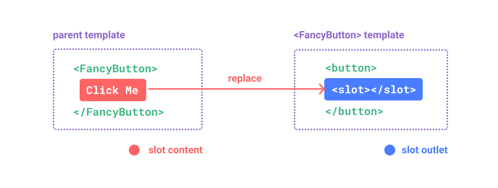
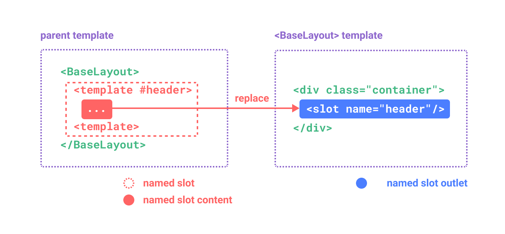
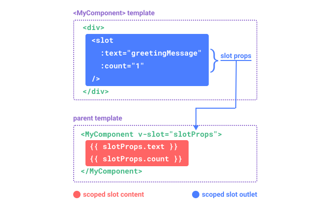

# 插槽 {#slots}

> 本页面假设你已经阅读过[组件基础](/guide/essentials/component-basics)。如果你是组件的新手，请先阅读那部分内容。

## 插槽内容和出口 {#slot-content-and-outlet}

我们已经知道组件可以接受 props，这些 props 可以是任何类型的 JavaScript 值。但是模板内容呢？在某些情况下，我们可能希望向子组件传递一个模板片段，并让子组件在其自己的模板中渲染该片段。

例如，我们可能有一个 `<FancyButton>` 组件，支持这样的用法：

```tsx{2}
<FancyButton>
  Click me! {/* 插槽内容 */}
</FancyButton>
```

`<FancyButton>` 的模板如下所示：

```tsx{2}
function FancyButton({ children }: { children?: React.ReactNode }) {
  return (
    <button class="fancy-btn">
      {children} {/* 插槽出口 */}
    </button>
  )
}
```

`children` 属性是一个**插槽出口**，表示父组件提供的**插槽内容**应该在哪里渲染。



<!-- https://www.figma.com/file/LjKTYVL97Ck6TEmBbstavX/slot -->

最终渲染的 DOM：

```html
<button class="fancy-btn">Click me!</button>
```

<div class="composition-api">

[在 Playground 中尝试](https://play.rue-jsjs.org/#eNpdUdlqAyEU/ZVbQ0kLMdNsXabTQFvoV8yLcRkkjopLSQj596oTwqRvnuM9y9UT+rR2/hs5qlHjqZM2gOch2m2rZW+NC/BDND1+xRCMBuFMD9N5NeKyeNrqphrUSZdA4L1VJPCEAJrRdCEAvpWke+g5NHcYg1cmADU6cB0A4zzThmYckqimupqiGfpXILe/zdwNhaki3n+0SOR5vAu6ReU++efUajtqYGJQ/FIg5w8Wt9FlOx+OKh/nV1c4ZVNqlHE1TIQQ7xnvCN13zkTNalBSc+Jw5wiTac2H1WLDeDeDyXrJVm9LWG7uE3hev3AhHge1cYwnO200L4QljEnd1bCxB1g82UNhe+I6qQs5kuGcE30NrxeaRudzOWtkemeXuHP5tLIKOv8BN+mw3w==)

</div>

通过使用插槽，`<FancyButton>` 负责渲染外层的 `<button>`（及其精美的样式），而内部内容由父组件提供。

理解插槽的另一种方式是将其与 JavaScript 函数进行比较：

```js
// 父组件传递插槽内容
FancyButton('Click me!')

// FancyButton 在其自己的模板中渲染插槽内容
function FancyButton(slotContent) {
  return `<button class="fancy-btn">
      ${slotContent}
    </button>`
}
```

插槽内容不仅限于文本。它可以是任何有效的模板内容。例如，我们可以传入多个元素，甚至其他组件：

```tsx
<FancyButton>
  <span style={{ color: 'red' }}>Click me!</span>
  <AwesomeIcon name="plus" />
</FancyButton>
```

<div class="composition-api">

[在 Playground 中尝试](https://play.rue-jsjs.org/#eNp1UmtOwkAQvspQYtCEgrx81EqCJibeoX+W7bRZaHc3+1AI4QyewH8ewvN4Aa/gbgtNIfFf5+vMfI/ZXbCQcvBmMYiCWFPFpAGNxsp5wlkphTLwQjjdPlljBIdMiRJ6g2EL88O9pnnxjlqU+EpbzS3s0BwPaypH4gqDpSyIQVcBxK3VFQDwXDC6hhJdlZi4zf3fRKwl4aDNtsDHJKCiECqiW8KTYH5c1gEnwnUdJ9rCh/XeM6Z42AgN+sFZAj6+Ux/LOjFaEK2diMz3h0vjNfj/zokuhPFU3lTdfcpShVOZcJ+DZgHs/HxtCrpZlj34eknoOlfC8jSCgnEkKswVSRlyczkZzVLM+9CdjtPJ/RjGswtX3ExvMcuu6mmhUnTruOBYAZKkKeN5BDO5gdG13FRoSVTOeAW2xkLPY3UEdweYWqW9OCkYN6gctq9uXllx2Z09CJ9dJwzBascI7nBYihWDldUGMqEgdTVIq6TQqCEMfUpNSD+fX7/fH+3b7P8AdGP6wA==)

</div>

通过使用插槽，我们的 `<FancyButton>` 更加灵活和可复用。我们现在可以在不同的地方使用不同的内部内容，但都使用相同的精美样式。

Rue 组件的插槽机制受到[原生 Web Component `<slot>` 元素](https://developer.mozilla.org/en-US/docs/Web/HTML/Element/slot)的启发，但具有我们将在后面看到的额外功能。

## 渲染作用域 {#render-scope}

插槽内容可以访问父组件的数据作用域，因为它是在父组件中定义的。例如：

```tsx
<span>{message}</span>
<FancyButton>{message}</FancyButton>
```

这里两个 <span v-pre>`{message}`</span> 插值将渲染相同的内容。

插槽内容**不能**访问子组件的数据。Vue 模板中的表达式只能访问定义它的作用域，这与 JavaScript 的词法作用域一致。换句话说：

> 父模板中的表达式只能访问父作用域；子模板中的表达式只能访问子作用域。

## 后备内容 {#fallback-content}

有时为插槽指定后备（即默认）内容很有用，仅在未提供内容时渲染。例如，在 `<SubmitButton>` 组件中：

```tsx
interface SubmitButtonProps {
  children?: React.ReactNode
}

function SubmitButton({ children }: SubmitButtonProps) {
  return <button type="submit">{children}</button>
}
```

如果父组件没有提供任何插槽内容，我们可能希望按钮内部渲染"Submit"文本。要使"Submit"成为后备内容，我们可以使用条件渲染：

```tsx{3}
function SubmitButton({ children }: SubmitButtonProps) {
  return (
    <button type="submit">
      {children ?? 'Submit'} {/* 后备内容 */}
    </button>
  )
}
```

现在当我们在父组件中使用 `<SubmitButton>` 且不提供插槽内容时：

```tsx
<SubmitButton />
```

这将渲染后备内容 "Submit"：

```html
<button type="submit">Submit</button>
```

但如果我们提供内容：

```tsx
<SubmitButton>Save</SubmitButton>
```

那么提供的内容将被渲染：

```html
<button type="submit">Save</button>
```

<div class="composition-api">

[在 Playground 中尝试](https://play.rue-jsjs.org/#eNp1kMsKwjAQRX9lzMaNbfcSC/oL3WbT1ikU8yKZFEX8d5MGgi2YVeZxZ86dN7taWy8B2ZlxP7rZEnikYFuhZ2WNI+jCoGa6BSKjYXJGwbFufpNJfhSaN1kflTEgVFb2hDEC4IeqguARpl7KoR8fQPgkqKpc3Wxo1lxRWWeW+Y4wBk9x9V9d2/UL8g1XbOJN4WAntodOnrecQ2agl8WLYH7tFyw5olj10iR3EJ+gPCxDFluj0YS6EAqKR8mi9M3Td1ifLxWShcU=)

</div>

## 具名插槽 {#named-slots}

有时在单个组件中有多个插槽出口很有用。例如，在一个具有以下模板的 `<BaseLayout>` 组件中：

```tsx
function BaseLayout({
  header,
  children,
  footer,
}: {
  header?: React.ReactNode
  children?: React.ReactNode
  footer?: React.ReactNode
}) {
  return (
    <div class="container">
      <header>{header}</header>
      <main>{children}</main>
      <footer>{footer}</footer>
    </div>
  )
}
```

在这些情况下，我们使用显式命名的 props 来分配不同的内容片段，这样你就可以决定内容应该在哪里渲染：

`children` prop 隐式具有名称 "default"，表示默认插槽。

在父组件中使用 `<BaseLayout>` 时，我们需要一种方法来传递多个插槽内容片段，每个片段针对不同的插槽出口。这就是**具名插槽**的用途。

要传递具名插槽，我们需要直接传递对应的 prop：

```tsx
<BaseLayout header={<h1>Here might be a page title</h1>} footer={<p>Here's some contact info</p>}>
  <p>A paragraph for the main content.</p>
  <p>And another one.</p>
</BaseLayout>
```



<!-- https://www.figma.com/file/2BhP8gVZevttBu9oUmUUyz/named-slot -->

当组件同时接受默认插槽和具名插槽时，所有顶层非命名节点都被隐式视为默认插槽的内容。所以上面的代码也可以写成：

```tsx
<BaseLayout
  header={<h1>Here might be a page title</h1>}
  footer={<p>Here's some contact info</p>}
  children={
    <>
      <p>A paragraph for the main content.</p>
      <p>And another one.</p>
    </>
  }
/>
```

现在传递给各个 props 的内容将被传递到相应的插槽。最终渲染的 HTML 将是：

```html
<div class="container">
  <header>
    <h1>Here might be a page title</h1>
  </header>
  <main>
    <p>A paragraph for the main content.</p>
    <p>And another one.</p>
  </main>
  <footer>
    <p>Here's some contact info</p>
  </footer>
</div>
```

<div class="composition-api">

[在 Playground 中尝试](https://play.rue-jsjs.org/#eNp9UsFuwjAM/RWrHLgMOi5o6jIkdtphn9BLSF0aKU2ixEVjiH+fm8JoQdvRfu/5xS8+ZVvvl4cOsyITUQXtCSJS5zel1a13geBdRvyUR9cR1MG1MF/mt1YvnZdW5IOWVVwQtt5IQq4AxI2cau5ccZg1KCsMlz4jzWrzgQGh1fuGYIcgwcs9AmkyKHKGLyPykcfD1Apr2ZmrHUN+s+U5Qe6D9A3ULgA1bCK1BeUsoaWlyPuVb3xbgbSOaQGcxRH8v3XtHI0X8mmfeYToWkxmUhFoW7s/JvblJLERmj1l0+T7T5tqK30AZWSMb2WW3LTFUGZXp/u8o3EEVrbI9AFjLn8mt38fN9GIPrSp/p4/Yoj7OMZ+A/boN9KInPeZZpAOLNLRDAsPZDgN4p0L/NQFOV/Ayn9x6EZXMFNKvQ4E5YwLBczW6/WlU3NIi6i/sYDn5Qu2qX1OF51MsvMPkrIEHg==)

</div>

再次，使用 JavaScript 函数类比可能有助于你更好地理解具名插槽：

```js
// 传递多个具有不同名称的插槽片段
BaseLayout({
  header: `...`,
  default: `...`,
  footer: `...`,
})

// <BaseLayout> 将它们渲染在不同的地方
function BaseLayout(slots) {
  return `<div class="container">
      <header>${slots.header}</header>
      <main>${slots.default}</main>
      <footer>${slots.footer}</footer>
    </div>`
}
```

## 条件插槽 {#conditional-slots}

有时你想根据是否向插槽传递了内容来渲染某些内容。

你可以通过检查 props 是否定义来实现这一点：

在下面的示例中，我们定义了一个具有三个条件插槽的 Card 组件：`header`、`footer` 和默认插槽。当 header / footer / 默认插槽有内容时，我们希望包装它以提供额外的样式：

```tsx
interface CardProps {
  header?: React.ReactNode
  footer?: React.ReactNode
  children?: React.ReactNode
}

function Card({ header, footer, children }: CardProps) {
  return (
    <div class="card">
      {header && <div class="card-header">{header}</div>}

      {children && <div class="card-content">{children}</div>}

      {footer && <div class="card-footer">{footer}</div>}
    </div>
  )
}
```

[在 Playground 中尝试](https://play.rue-jsjs.org/#eNqVVMtu2zAQ/BWCLZBLIjVoTq4aoA1yaA9t0eaoCy2tJcYUSZCUKyPwv2dJioplOw4C+EDuzM4+ONYT/aZ1tumBLmhhK8O1IxZcr29LyTutjCN3zNRkZVRHLrLcXzz9opRFHvnIxIuDTgvmAG+EFJ4WTnhOCPnQAqvBjHFE2uvbh5Zbgj/XAolwkWN4TM33VI/UalixXvjyo5yeqVVKOpCuyP0ob6utlHL7vUE3U4twkWP4hJq/jiPP4vSSOouNrHiTPVolcclPnl3SSnWaCzC/teNK2pIuSEA8xoRQ/3+GmDM9XKZ41UK1PhF/tIOPlfSPAQtmAyWdMMdMAy7C9/9+wYDnCexU3QtknwH/glWi9z1G2vde1tj2Hi90+yNYhcvmwd4PuHabhvKNeuYu8EuK1rk7M/pLu5+zm5BXyh1uMdnOu3S+95pvSCWYtV9xQcgqaXogj2yu+AqBj1YoZ7NosJLOEq5S9OXtPZtI1gFSppx8engUHs+vVhq9eVhq9ORRrXdpRyseSqfo6SmmnONK6XTw9yis24q448wXSG+0VAb3sSDXeiBoDV6TpWDV+ktENatrdMGCfAoBfL1JYNzzpINJjVFoJ9yKUKho19ul6OFQ6UYPx1rjIpPYeXIc/vXCgjetawzbni0dPnhhJ3T3DMVSruI=)

## 动态插槽名称 {#dynamic-slot-names}

动态值也可以用作插槽的 prop 名称：

```tsx
function Parent() {
  const slotName = 'header'

  return (
    <BaseLayout
      {...(slotName === 'header' && { header: <div>Header Content</div> })}
      {...(slotName === 'footer' && { footer: <div>Footer Content</div> })}
    />
  )
}
```

请注意，表达式受动态参数语法约束的限制。

## 作用域插槽 {#scoped-slots}

正如在[渲染作用域](#render-scope)中讨论的，插槽内容无法访问子组件中的状态。

然而，在某些情况下，如果插槽内容能够使用来自父作用域和子作用域的数据会很有用。为了实现这一点，我们需要一种方法让子组件在渲染时向插槽传递数据。

事实上，我们可以做到这一点——我们可以向插槽传递属性，就像向组件传递 props 一样：

```tsx
// <MyComponent> 模板
interface MyComponentProps {
  children?: (slotProps: { text: string; count: number }) => React.ReactNode
}

function MyComponent({ children }: MyComponentProps) {
  const greetingMessage = 'hello'

  return <div>{children?.({ text: greetingMessage, count: 1 })}</div>
}
```

接收插槽 props 时使用 render prop 模式：

```tsx
<MyComponent>
  {slotProps => (
    <>
      {slotProps.text} {slotProps.count}
    </>
  )}
</MyComponent>
```



<!-- https://www.figma.com/file/QRneoj8eIdL1kw3WQaaEyc/scoped-slot -->

<div class="composition-api">

[在 Playground 中尝试](https://play.rue-jsjs.org/#eNp9kMEKgzAMhl8l9OJlU3aVOhg7C3uAXsRlTtC2tFE2pO++dA5xMnZqk+b/8/2dxMnadBxQ5EL62rWWwCMN9qh021vjCMrn2fBNoya4OdNDkmarXhQnSstsVrOOC8LedhVhrEiuHca97wwVSsTj4oz1SvAUgKJpgqWZEj4IQoCvZm0Gtgghzss1BDvIbFkqdmID+CNdbbQnaBwitbop0fuqQSgguWPXmX+JePe1HT/QMtJBHnE51MZOCcjfzPx04JxsydPzp2Szxxo7vABY1I/p)

</div>

传递给子组件插槽的 props 可作为 render prop 函数的参数访问，可以在插槽内的表达式中访问。

你可以将作用域插槽想象成传入子组件的函数。子组件调用它，将 props 作为参数传递：

```js
MyComponent({
  // 传递默认插槽，但以函数形式
  children: slotProps => {
    return `${slotProps.text} ${slotProps.count}`
  },
})

function MyComponent(slots) {
  const greetingMessage = 'hello'
  return `<div>${
    // 调用插槽函数并传递 props！
    slots.children({ text: greetingMessage, count: 1 })
  }</div>`
}
```

事实上，这与作用域插槽的编译方式非常接近，也是你在手动 [渲染函数](/guide/extras/render-function) 中使用作用域插槽的方式。

注意 render prop 函数签名如何匹配。就像函数参数一样，我们可以在 render prop 中使用解构：

```tsx
<MyComponent>
  {({ text, count }) => (
    <>
      {text} {count}
    </>
  )}
</MyComponent>
```

### 具名作用域插槽 {#named-scoped-slots}

具名作用域插槽的工作方式类似——插槽 props 作为 render prop 函数的参数访问：

```tsx
<MyComponent
  header={({ message }) => <div>{message}</div>}
  footer={({ info }) => <div>{info}</div>}
>
  {({ message }) => <p>{message}</p>}
</MyComponent>
```

向具名插槽传递 props：

```tsx
interface MyComponentProps {
  header?: (props: { message: string }) => React.ReactNode
  footer?: React.ReactNode
  children?: (props: { message: string }) => React.ReactNode
}

function MyComponent({ header, footer, children }: MyComponentProps) {
  return (
    <div>
      <header>{header?.({ message: 'hello' })}</header>
      <main>{children?.({ message: 'world' })}</main>
      <footer>{footer}</footer>
    </div>
  )
}
```

注意插槽的 `name` 不会包含在 props 中，因为它是保留的——所以结果会是 `{ message: 'hello' }`。

### Fancy List 示例 {#fancy-list-example}

你可能想知道作用域插槽有什么好的用例。这里有一个例子：想象一个 `<FancyList>` 组件，它渲染一个项目列表——它可能封装了加载远程数据的逻辑，使用数据显示列表，甚至是分页或无限滚动等高级功能。然而，我们希望它在每个项目的外观上保持灵活，并将每个项目的样式留给消费它的父组件。所以期望的用法可能看起来像这样：

```tsx
<FancyList apiUrl={url} perPage={10}>
  {({ body, username, likes }) => (
    <div class="item">
      <p>{body}</p>
      <p>
        by {username} | {likes} likes
      </p>
    </div>
  )}
</FancyList>
```

在 `<FancyList>` 内部，我们可以使用不同的项目数据多次渲染相同的插槽（注意我们使用 render prop 来传递项目数据）：

```tsx
interface FancyListProps {
  apiUrl: string
  perPage: number
  children: (item: { body: string; username: string; likes: number }) => React.ReactNode
}

function FancyList({ apiUrl, perPage, children }: FancyListProps) {
  const items = ref([])

  // 加载数据...

  return (
    <ul>
      {items.value.map(item => (
        <li key={item.id}>{children(item)}</li>
      ))}
    </ul>
  )
}
```

<div class="composition-api">

[在 Playground 中尝试](https://play.rue-jsjs.org/#eNqFU2Fv0zAQ/StHJtROapNuZTBCNwnQQKBpTGxCQss+uMml8+bYlu2UlZL/zjlp0lQa40sU3/nd3Xv3vA7eax0uSwziYGZTw7UDi67Up4nkhVbGwScm09U5tw5yowoYhFEX8cBBImdRgyQMHRwWWjCHdAKYbdFM83FpxEkS0DcJINZoxpotkCIHkySo7xOixcMep19KrmGustUISotGsgJHIPgDWqg6DKEyvoRUMGsJ4HG9HGX16bqpAlU1izy5baqDFegYweYroMttMwLAHx/Y9Kyan36RWUTN2+mjXfpbrei8k6SjdSuBYFOlMaNI6AeAtcflSrqx5b8xhkl4jMU7H0yVUCaGvVeH8+PjKYWqWnpf5DQYBTtb+fc612Awh2qzzGaBiUyVpBVpo7SFE8gw5xIv/Wl4M9gsbjCCQbuywe3+FuXl9iiqO7xpElEEhUofKFQo2mTGiFiOLr3jcpFImuiaF6hKNxzuw8lpw7kuEy6ZKJGK3TR6NluLYXBVqwRXQjkLn0ueIc3TLonyZ0sm4acqKVovKIbDCVQjGsb1qvyg2telU4Yzz6eHv6ARBWdwjVqUNCbbFjqgQn6aW1J8RKfJhDg+5/lStG4QHJZjnpO5XjT0BMqFu+uZ81yxjEQJw7A1kOA76FyZjaWBy0akvu8tCQKeQ+d7wsy5zLpz1FlzU3kW1QP+x40ApWgWAySEJTv6/NitNMkllcTakwCaZZ5ADEf6cROas/RhYVQps5igEpkZLwzRROmG04OjDBcj7+Js+vYQDo9e0uH1qzeY5/s1vtaaqG969+vTTrsmBTMLLv12nuy7l+d5W673SBzxkzlfhPdWSXokdZMkSFWhuUDzTTtOnk6CuG2fBEwI9etrHXOmRLJUE0/vMH14In5vH30sCS4Nkr+WmARdztHQ6Jr02dUFPtJ/lyxUVgq6/UzyO1olSj9jc+0DcaWxe/fqab/UT51Uu7Znjw6lbUn5QWtR6vtJQM//4zPUt+NOw+lGzCqo/gLm1QS8)

</div>

### 无渲染组件 {#renderless-components}

我们上面讨论的 `<FancyList>` 用例封装了可复用的逻辑（数据获取、分页等）和视觉输出，同时通过作用域插槽将部分视觉输出委托给消费组件。

如果我们把这个概念推进一步，我们可以想出只封装逻辑而不自己渲染任何内容的组件——视觉输出完全通过作用域插槽委托给消费组件。我们把这种类型的组件称为**无渲染组件**。

一个无渲染组件的例子可能是一个封装了跟踪当前鼠标位置逻辑的组件：

```tsx
interface MouseTrackerProps {
  children: (state: { x: number; y: number }) => React.ReactNode
}

function MouseTracker({ children }: MouseTrackerProps) {
  const x = ref(0)
  const y = ref(0)

  function updatePosition(e: MouseEvent) {
    x.value = e.pageX
    y.value = e.pageY
  }

  onMounted(() => {
    window.addEventListener('mousemove', updatePosition)
  })

  onUnmounted(() => {
    window.removeEventListener('mousemove', updatePosition)
  })

  return <>{children({ x: x.value, y: y.value })}</>
}
```

使用：

```tsx
<MouseTracker>
  {({ x, y }) => (
    <div>
      Mouse is at: {x}, {y}
    </div>
  )}
</MouseTracker>
```

<div class="composition-api">

[在 Playground 中尝试](https://play.rue-jsjs.org/#eNqNUcFqhDAQ/ZUhF12w2rO4Cz301t5aaCEX0dki1SQko6uI/96J7i4qLPQQmHmZ9+Y9ZhQvxsRdiyIVmStsZQgcUmtOUlWN0ZbgXbcOP2xe/KKFs9UNBHGyBj09kCpLFj4zuSFsTJ0T+o6yjUb35GpNRylG6CMYYJKCpwAkzWNQOcgphZG/YZoiX/DQNAttFjMrS+6LRCT2rh6HGsHiOQKtmKIIS19+qmZpYLrmXIKxM1Vo5Yj9HD0vfD7ckGGF3LDWlOyHP/idYPQCfdzldTtjscl/8MuDww78lsqHVHdTYXjwCpdKlfoS52X52qGit8oRKrRhwHYdNrrDILouPbCNVZCtgJ1n/6Xx8JYAmT8epD3fr5cC0oGLQYpkd4zpD27R0vA=)

</div>

虽然这是一个有趣的实现方式，但大多数可以用无渲染组件实现的功能都可以用 Composition API 更高效地实现，而不会产生额外的组件嵌套开销。稍后，我们将看到如何将此鼠标跟踪功能实现为 [组合式函数](/guide/reusability/composables)。

也就是说，在需要同时封装逻辑**和**组合视觉输出的情况下，作用域插槽仍然很有用，就像 `<FancyList>` 示例一样。
