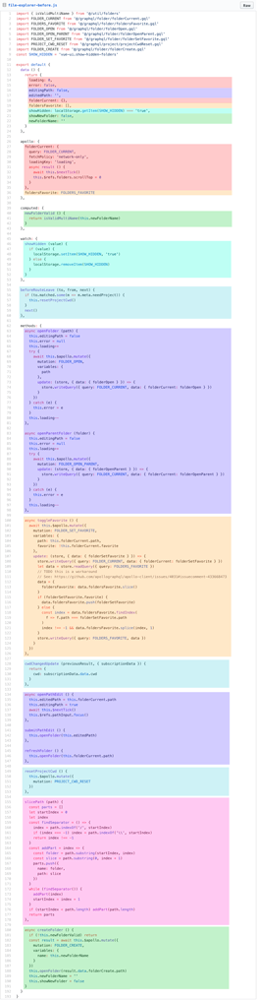
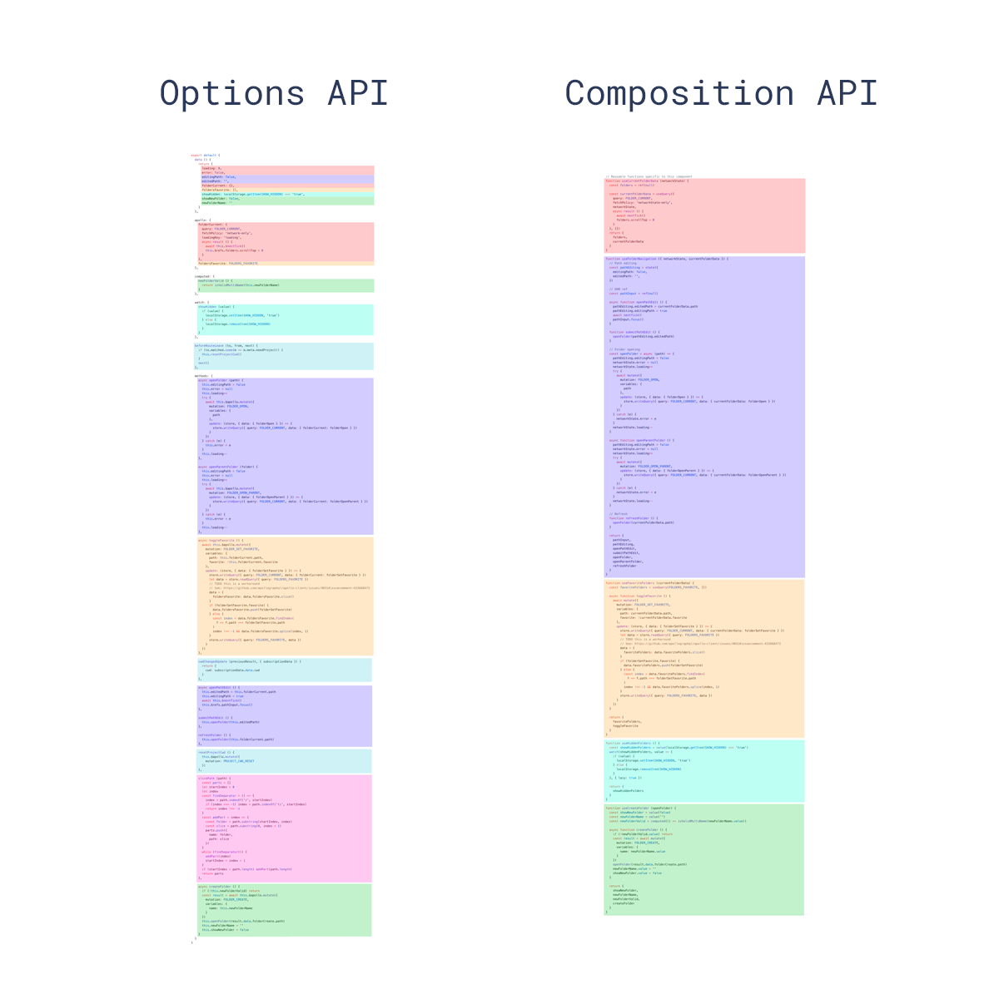

# Composition API 常见问题 {#composition-api-faq}

:::tip
此 FAQ 假定你已经具备 Rue 的先验经验——特别是使用 Options API 的 Rue 2 经验。
:::

## 什么是 Composition API？ {#what-is-composition-api}

Composition API 是一组 API，允许我们使用导入的函数而不是声明选项来编写 Rue 组件。它是一个涵盖以下 API 的统称：

- [Reactivity API](/api/reactivity-core)，例如 `ref()` 和 `reactive()`，允许我们直接创建响应式状态、计算状态和 watchers。

- [生命周期钩子](/api/composition-api-lifecycle)，例如 `onMounted()` 和 `onUnmounted()`，允许我们以编程方式钩入组件生命周期。

- [依赖注入](/api/composition-api-dependency-injection)，即 `provide()` 和 `inject()`，允许我们在使用 Reactivity API 时利用 Rue 的依赖注入系统。

Composition API 是 Rue 3 和 [Rue 2.7](https://blog.@rue-js/ruejs.org/posts/rue-2-7-naruto.html) 的内置功能。对于较旧的 Rue 2 版本，请使用官方维护的 [`rue-composition-api`](https://github.com/@rue-js/ruejs/composition-api) 插件。在 Rue 3 中，它主要与单文件组件中的 [`<script setup>`](/api/sfc-script-setup) 语法一起使用。以下是使用 Composition API 的组件的基本示例：

```tsx
import { ref, onMounted } from '@rue-js/rue'
import type { FC } from '@rue-js/rue'

const App: FC = () => {
  // 响应式状态
  const count = ref(0)

  // 改变状态并触发更新的函数
  const increment = () => {
    count.value++
  }

  // 生命周期钩子
  onMounted(() => {
    console.log(`初始计数为 ${count.value}。`)
  })

  return <button onClick={increment}>Count is: {count.value}</button>
}
```

尽管 Composition API 基于函数组合的 API 风格，**Composition API 不是函数式编程**。Composition API 基于 Rue 的可变、细粒度响应式范式，而函数式编程强调不可变性。

如果你想学习如何使用 Composition API 的 Rue，可以使用左侧边栏顶部的切换按钮将站点范围的 API 首选项设置为 Composition API，然后从头开始阅读指南。

## 为什么使用 Composition API？ {#why-composition-api}

### 更好的逻辑复用 {#better-logic-reuse}

Composition API 的主要优势在于它能够实现干净、高效的逻辑复用，形式为 [Composable 函数](/guide/reusability/composables)。它解决了 [mixins 的所有缺点](/guide/reusability/composables#vs-mixins)，这是 Options API 的主要逻辑复用机制。

Composition API 的逻辑复用能力催生了令人印象深刻的社区项目，例如 [RueUse](https://rueuse.org/)，一个不断增长的 composable 工具集合。它还作为将有状态的第三方服务或库轻松集成到 Rue 响应式系统中的干净机制，例如 [不可变数据](/guide/extras/reactivity-in-depth#immutable-data)、[状态机](/guide/extras/reactivity-in-depth#state-machines) 和 [RxJS](/guide/extras/reactivity-in-depth#rxjs)。

### 更灵活的代码组织 {#more-flexible-code-organization}

许多用户喜欢我们默认使用 Options API 编写有组织的代码：所有内容都根据其所属的选项有其位置。然而，当单个组件的逻辑增长超过一定复杂性阈值时，Options API 会带来严重的限制。这种限制在需要处理多个**逻辑关注点**的组件中尤为突出，我们在许多生产级 Rue 2 应用中亲眼目睹了这一点。

以 Rue CLI 的 GUI 中的文件夹资源管理器组件为例：该组件负责以下逻辑关注点：

- 跟踪当前文件夹状态并显示其内容
- 处理文件夹导航（打开、关闭、刷新...）
- 处理新建文件夹
- 切换仅显示收藏夹文件夹
- 切换显示隐藏文件夹
- 处理当前工作目录更改

该组件的[原始版本](https://github.com/@rue-js/ruejs/rue-cli/blob/a09407dd5b9f18ace7501ddb603b95e31d6d93c0/packages/rue-cli-ui/src/components/folder/FolderExplorer.vue#L198-L404)是用 Options API 编写的。如果我们根据代码处理的逻辑关注点为每一行代码着色，它看起来是这样的：



注意处理相同逻辑关注点的代码如何被迫在不同的选项下分割，位于文件的不同部分。在一个长达数百行的组件中，理解和导航单个逻辑关注点需要不断地在文件中上下滚动，这比平时要困难得多。此外，如果我们打算将逻辑关注点提取为可复用的工具，则需要花费大量工作从文件的不同部分找到并提取正确的代码片段。

以下是同一组件在[重构为 Composition API](https://gist.github.com/yyx990803/8854f8f6a97631576c14b63c8acd8f2e) 之前和之后的样子：



注意与相同逻辑关注点相关的代码现在如何可以组合在一起：我们在处理特定逻辑关注点时不再需要在不同的选项块之间跳转。此外，我们现在可以用最小的努力将一组代码移到外部文件中，因为我们不再需要为了提取它们而四处移动代码。这种减少的重构摩擦是大型代码库长期可维护性的关键。

### 更好的类型推断 {#better-type-inference}

近年来，越来越多的前端开发者采用 [TypeScript](https://www.typescriptlang.org/)，因为它帮助我们编写更健壮的代码，更有信心地进行更改，并提供出色的 IDE 支持的开发体验。然而，最初于 2013 年设计的 Options API 并没有考虑类型推断。我们不得不实现一些[极其复杂的类型体操](https://github.com/@rue-js/ruejs/core/blob/44b95276f5c086e1d88fa3c686a5f39eb5bb7821/packages/runtime-core/src/componentPublicInstance.ts#L132-L165)来使类型推断与 Options API 一起工作。即使付出了所有这些努力，Options API 的类型推断仍然可能在 mixins 和依赖注入时失效。

这导致许多希望将 TypeScript 与 Rue 一起使用的开发者倾向于使用由 `rue-class-component` 提供支持的 Class API。然而，基于类的 API 严重依赖于 ES 装饰器，这是 Rue 3 于 2019 年开发时仍处于第 2 阶段提案的语言特性。我们认为基于不稳定的提案来构建官方 API 风险太大。从那以后，装饰器提案经历了又一次彻底的改革，最终于 2022 年达到第 3 阶段。此外，基于类的 API 受到与 Options API 类似的逻辑复用和组织限制。

相比之下，Composition API 主要使用普通变量和函数，它们自然对类型友好。用 Composition API 编写的代码可以享受完整的类型推断，几乎不需要手动类型提示。大多数时候，Composition API 代码在 TypeScript 和普通 JavaScript 中看起来大致相同。这也使得纯 JavaScript 用户能够从部分类型推断中受益。

### 更小的生产包和更少的开销 {#smaller-production-bundle-and-less-overhead}

使用 Composition API 和 `<script setup>` 编写的代码也比等效的 Options API 更高效且更易于压缩。这是因为 `<script setup>` 组件中的模板被编译为内联在 `<script setup>` 代码同一作用域中的函数。与从 `this` 进行属性访问不同，编译后的模板代码可以直接访问 `<script setup>` 内部声明的变量，而无需实例代理在中间。这也带来了更好的压缩效果，因为所有变量名都可以安全地缩短。

## 与 Options API 的关系 {#relationship-with-options-api}

### 权衡 {#trade-offs}

一些从 Options API 迁移过来的用户发现他们的 Composition API 代码组织性较差，并得出结论认为 Composition API 在代码组织方面"更差"。我们建议有这些意见的用户从不同的角度看待这个问题。

确实，Composition API 不再提供引导你将代码放入相应桶中的"护栏"。作为回报，你可以像编写普通 JavaScript 一样编写组件代码。这意味着**你可以而且应该像你编写普通 JavaScript 时一样，将任何代码组织最佳实践应用到你的 Composition API 代码中**。如果你能编写组织良好的 JavaScript，你也应该能够编写组织良好的 Composition API 代码。

Options API 确实允许你在编写组件代码时"少想一些"，这就是为什么许多用户喜欢它。然而，在减少心智开销的同时，它也将你锁定在规定的代码组织模式中，没有逃脱舱口，这可能使在更大规模项目中重构或提高代码质量变得困难。在这方面，Composition API 提供了更好的长期可扩展性。

### Composition API 是否涵盖所有用例？ {#does-composition-api-cover-all-use-cases}

就状态逻辑而言，是的。使用 Composition API 时，可能仍然只需要几个选项：`props`、`emits`、`name` 和 `inheritAttrs`。

:::tip

从 3.3 版本开始，你可以直接在 `<script setup>` 中使用 `defineOptions` 来设置组件名称或 `inheritAttrs` 属性

:::

如果你打算专门使用 Composition API（以及上面列出的选项），你可以通过[编译时标志](/api/compile-time-flags)从 Rue 中删除 Options API 相关代码，从而节省几 KB 的生产包。请注意，这也会影响依赖项中的 Rue 组件。

### 可以在同一组件中使用两种 API 吗？ {#can-i-use-both-apis-in-the-same-component}

可以。你可以通过 Options API 组件中的 [`setup()`](/api/composition-api-setup) 选项使用 Composition API。

但是，我们只建议在你有现有的 Options API 代码库需要与用 Composition API 编写的新功能/外部库集成时才这样做。

### Options API 会被弃用吗？ {#will-options-api-be-deprecated}

不会，我们没有任何这样做的计划。Options API 是 Rue 不可或缺的一部分，也是许多开发者喜欢它的原因。我们还意识到 Composition API 的许多优势只在大规模项目中显现，而 Options API 仍然是许多低到中等复杂度场景的可靠选择。

## 与 Class API 的关系 {#relationship-with-class-api}

鉴于 Composition API 提供了出色的 TypeScript 集成以及额外的逻辑复用和代码组织优势，我们不再建议在 Rue 3 中使用 Class API。

## 与 React Hooks 的比较 {#comparison-with-react-hooks}

Composition API 提供了与 React Hooks 相同级别的逻辑组合能力，但有一些重要的区别。

React Hooks 在每次组件更新时都会重复调用。这产生了许多可能让即使是经验丰富的 React 开发者也感到困惑的注意事项。它还导致可能影响开发体验的性能优化问题。以下是一些例子：

- Hooks 对调用顺序敏感，不能是条件性的。

- 在 React 组件中声明的变量可以被 hook 闭包捕获，如果开发者未能传入正确的依赖数组，就会变成"陈旧的"。这导致 React 开发者依赖 ESLint 规则来确保传入正确的依赖。然而，该规则往往不够智能，过度补偿正确性，这导致在遇到边缘情况时不必要的失效和头痛。

- 昂贵的计算需要使用 `useMemo`，这再次需要手动传入正确的依赖数组。

- 传递给子组件的事件处理程序默认会导致不必要的子更新，需要显式的 `useCallback` 作为优化。这几乎总是需要的，并且再次需要正确的依赖数组。忽视这一点会导致默认情况下的过度渲染应用，并可能在未意识到的情况下造成性能问题。

- 陈旧闭包问题与 Concurrent 特性相结合，使得很难推断一段 hooks 代码何时运行，并使处理应该在渲染之间持久化的可变状态（通过 `useRef`）变得繁琐。

> 注意：一些与记忆化相关的上述问题可以通过即将推出的 [React Compiler](https://react.dev/learn/react-compiler) 解决。

相比之下，Rue Composition API：

- 只调用一次 `setup()` 或 `<script setup>` 代码。这使得代码更符合习惯用法的 JavaScript 使用直觉，因为不必担心陈旧的闭包。Composition API 调用也对调用顺序不敏感，可以是条件性的。

- Rue 的运行时响应式系统自动收集计算属性和 watchers 中使用的响应式依赖，因此无需手动声明依赖。

- 无需手动缓存回调函数以避免不必要的子更新。总的来说，Rue 的细粒度响应式系统确保子组件只在需要时才更新。手动子更新优化很少是 Rue 开发者需要担心的问题。

我们承认 React Hooks 的创意，它是 Composition API 的主要灵感来源。然而，上述问题确实存在于其设计中，我们注意到 Rue 的响应式模型恰好提供了一种绕过它们的方法。
