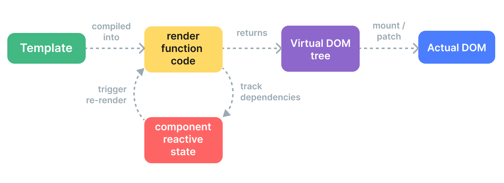

# 渲染机制 {#rendering-mechanism}

Rue 如何将模板转换为实际的 DOM 节点？Rue 如何高效地更新这些 DOM 节点？我们将尝试通过深入探讨 Rue 的内部渲染机制来阐明这些问题。

## 虚拟 DOM {#virtual-dom}

你可能听说过"虚拟 DOM"这个词，Rue 的渲染系统就是基于它的。

虚拟 DOM（VDOM）是一种编程概念，其中 UI 的理想或"虚拟"表示保存在内存中，并与"真实"DOM 同步。这个概念由 [React](https://react.dev/) 开创，并已被许多其他框架采用，包括 Rue，但实现方式不同。

虚拟 DOM 与其说是一种特定技术，不如说是一种模式，因此没有一种规范的实现。我们可以使用一个简单的示例来说明这个想法：

```js
const vnode = {
  type: 'div',
  props: {
    id: 'hello',
  },
  children: [
    /* 更多 vnodes */
  ],
}
```

这里，`vnode` 是一个表示 `<div>` 元素的普通 JavaScript 对象（"虚拟节点"）。它包含我们需要创建实际元素的所有信息。它还包含更多的子 vnode，这使它成为虚拟 DOM 树的根。

运行时渲染器可以遍历虚拟 DOM 树并从中构建真实的 DOM 树。这个过程称为**挂载**。

如果我们有两个虚拟 DOM 树的副本，渲染器还可以遍历并比较两棵树，找出差异，并将这些更改应用到实际的 DOM。这个过程称为**补丁**，也称为"差异比较"或"调和"。

虚拟 DOM 的主要好处是它为开发者提供了以声明方式编程创建、检查和组合所需 UI 结构的能力，同时将直接 DOM 操作留给渲染器。

## 渲染管道 {#render-pipeline}

在高层次上，当挂载 Rue 组件时会发生以下情况：

1. **编译**：Rue 模板被编译成**渲染函数**：返回虚拟 DOM 树的函数。这一步可以通过构建步骤提前完成，也可以通过使用运行时编译器即时完成。

2. **挂载**：运行时渲染器调用渲染函数，遍历返回的虚拟 DOM 树，并基于它创建实际的 DOM 节点。这一步作为[响应式 effect](./reactivity-in-depth)执行，因此它会跟踪所有使用过的响应式依赖。

3. **补丁**：当挂载期间使用的依赖发生更改时，effect 重新运行。这次，创建了一个新的、更新的虚拟 DOM 树。运行时渲染器遍历新树，将其与旧树比较，并将必要的更新应用到实际的 DOM。



<!-- https://www.figma.com/file/elViLsnxGJ9lsQVsuhwqxM/Rendering-Mechanism -->

## 模板与渲染函数 {#templates-vs-render-functions}

Rue 模板被编译成虚拟 DOM 渲染函数。Rue 还提供了允许我们跳过模板编译步骤并直接编写渲染函数的 API。在处理高度动态逻辑时，渲染函数比模板更灵活，因为你可以使用 JavaScript 的完整能力与 vnode 一起工作。

那么为什么 Rue 默认推荐模板呢？有很多原因：

1. 模板更接近实际的 HTML。这使得重用现有的 HTML 片段、应用可访问性最佳实践、使用 CSS 样式以及让设计师理解和修改变得更加容易。

2. 由于其更具确定性的语法，模板更容易进行静态分析。这允许 Rue 的模板编译器应用许多编译时优化来提高虚拟 DOM 的性能（我们将在下面讨论）。

在实践中，模板足以满足应用程序中的大多数用例。渲染函数通常只用于需要处理高度动态渲染逻辑的可复用组件。渲染函数的使用在[渲染函数与 JSX](./render-function)中更详细地讨论。

## 编译器知情的虚拟 DOM {#compiler-informed-virtual-dom}

React 和大多数其他虚拟 DOM 实现中的虚拟 DOM 实现纯粹是运行时的：调和算法不能对传入的虚拟 DOM 树做出任何假设，因此它必须完全遍历树并比较每个 vnode 的 props 以确保正确性。此外，即使树的某部分永远不会更改，每次重新渲染时都会为它们创建新的 vnode，导致不必要的内存压力。这是虚拟 DOM 最受批评的方面之一：有些蛮力的调和过程以效率换取声明性和正确性。

但不必如此。在 Rue 中，框架同时控制编译器和运行时。这使我们能够实现许多只有紧密耦合的渲染器才能利用的编译时优化。编译器可以静态分析模板并在生成的代码中留下提示，以便运行时可以在可能的情况下走捷径。同时，我们仍然保留让用户在边缘情况下下降到渲染函数层以获得更直接控制的能力。我们称这种混合方法为**编译器知情的虚拟 DOM**。

下面，我们将讨论 Rue 模板编译器为改善虚拟 DOM 运行时性能所做的一些主要优化。

### 静态提升 {#cache-static}

模板中经常会有不包含任何动态绑定的部分：

```vue-html{2-3}
<div>
  <div>foo</div> <!-- 缓存 -->
  <div>bar</div> <!-- 缓存 -->
  <div>{{ dynamic }}</div>
</div>
```

[在模板资源管理器中检查](https://template-explorer.@rue-js/ruejs.org/#eyJzcmMiOiI8ZGl2PlxuICA8ZGl2PmZvbzwvZGl2PiA8IS0tIGNhY2hlZCAtLT5cbiAgPGRpdj5iYXI8L2Rpdj4gPCEtLSBjYWNoZWQgLS0+XG4gIDxkaXY+e3sgZHluYW1pYyB9fTwvZGl2PlxuPC9kaXY+XG4iLCJvcHRpb25zIjp7ImhvaXN0U3RhdGljIjp0cnVlfX0=)

`foo` 和 `bar` div 是静态的——在每次重新渲染时重新创建 vnode 并比较它们是不必要的。渲染器在初始渲染期间创建这些 vnode，缓存它们，并在每次后续重新渲染时重用相同的 vnode。当渲染器注意到旧 vnode 和新 vnode 是同一个时，它还能够完全跳过比较它们。

此外，当有足够多的连续静态元素时，它们将被压缩成一个包含所有这些节点的纯 HTML 字符串的单个"静态 vnode"（[示例](https://template-explorer.@rue-js/ruejs.org/#eyJzcmMiOiI8ZGl2PlxuICA8ZGl2IGNsYXNzPVwiZm9vXCI+Zm9vPC9kaXY+XG4gIDxkaXYgY2xhc3M9XCJmb29cIj5mb288L2Rpdj5cbiAgPGRpdiBjbGFzcz1cImZvb1wiPmZvbzwvZGl2PlxuICA8ZGl2IGNsYXNzPVwiZm9vXCI+Zm9vPC9kaXY+XG4gIDxkaXYgY2xhc3M9XCJmb29cIj5mb288L2Rpdj5cbiAgPGRpdj57eyBkeW5hbWljIH19PC9kaXY+XG48L2Rpdj4iLCJzc3IiOmZhbHNlLCJvcHRpb25zIjp7ImhvaXN0U3RhdGljIjp0cnVlfX0=)）。这些静态 vnode 通过直接设置 `innerHTML` 来挂载。

### Patch 标志 {#patch-flags}

对于具有动态绑定的单个元素，我们也可以在编译时从中推断出很多信息：

```vue-html
<!-- 仅 class 绑定 -->
<div :class="{ active }"></div>

<!-- 仅 id 和 value 绑定 -->
<input :id="id" :value="value">

<!-- 仅文本 children -->
<div>{{ dynamic }}</div>
```

[在模板资源管理器中检查](https://template-explorer.@rue-js/ruejs.org/#eyJzcmMiOiI8ZGl2IDpjbGFzcz1cInsgYWN0aXZlIH1cIj48L2Rpdj5cblxuPGlucHV0IDppZD1cImlkXCIgOnZhbHVlPVwidmFsdWVcIj5cblxuPGRpdj57eyBkeW5hbWljIH19PC9kaXY+Iiwib3B0aW9ucyI6e319)

在为这些元素生成渲染函数代码时，Rue 将每个元素需要的更新类型直接编码在 vnode 创建调用中：

```js{3}
createElementVNode("div", {
  class: _normalizeClass({ active: _ctx.active })
}, null, 2 /* CLASS */)
```

最后一个参数 `2` 是一个 [patch flag](https://github.com/@rue-js/ruejs/core/blob/main/packages/shared/src/patchFlags.ts)。一个元素可以有多个 patch flag，它们将被合并为一个数字。然后运行时渲染器可以使用[位运算](https://en.wikipedia.org/wiki/Bitwise_operation)检查标志以确定是否需要执行某些工作：

```js
if (vnode.patchFlag & PatchFlags.CLASS /* 2 */) {
  // 更新元素的 class
}
```

位运算检查极快。使用 patch flags，Rue 能够在更新具有动态绑定的元素时完成最少的工作量。

Rue 还对 vnode 具有的 children 类型进行编码。例如，具有多个根节点的模板被表示为片段。在大多数情况下，我们确信这些根节点的顺序永远不会改变，因此这些信息也可以作为 patch flag 提供给运行时：

```js{4}
export function render() {
  return (_openBlock(), _createElementBlock(_Fragment, null, [
    /* children */
  ], 64 /* STABLE_FRAGMENT */))
}
```

因此，运行时可以完全跳过根片段的子顺序调和。

### 树扁平化 {#tree-flattening}

再看一下前面示例中的生成代码，你会注意到返回的虚拟 DOM 树的根是使用特殊的 `createElementBlock()` 调用创建的：

```js{2}
export function render() {
  return (_openBlock(), _createElementBlock(_Fragment, null, [
    /* children */
  ], 64 /* STABLE_FRAGMENT */))
}
```

从概念上讲，"块"是模板中具有稳定内部结构的部分。在这种情况下，整个模板有一个块，因为它不包含任何像 `v-if` 和 `v-for` 这样的结构指令。

每个块跟踪任何具有 patch flags 的后代节点（不仅仅是直接子节点）。例如：

```vue-html{3,5}
<div> <!-- 根块 -->
  <div>...</div>         <!-- 未跟踪 -->
  <div :id="id"></div>   <!-- 已跟踪 -->
  <div>                  <!-- 未跟踪 -->
    <div>{{ bar }}</div> <!-- 已跟踪 -->
  </div>
</div>
```

结果是一个扁平化的数组，只包含动态后代节点：

```
div (块根)
- 带有 :id 绑定的 div
- 带有 {{ bar }} 绑定的 div
```

当这个组件需要重新渲染时，它只需要遍历扁平化的树而不是完整的树。这称为**树扁平化**，它大大减少了虚拟 DOM 调和期间需要遍历的节点数量。模板的任何静态部分实际上都被跳过了。

`v-if` 和 `v-for` 指令将创建新的块节点：

```vue-html
<div> <!-- 根块 -->
  <div>
    <div v-if> <!-- if 块 -->
      ...
    </div>
  </div>
</div>
```

子块在父块的动态后代数组中被跟踪。这为父块保留了稳定的结构。

### 对 SSR 水合的影响 {#impact-on-ssr-hydration}

Patch flags 和树扁平化也大大提高了 Rue 的 [SSR 水合](/guide/scaling-up/ssr#client-hydration)性能：

- 单个元素水合可以基于相应 vnode 的 patch flag 采取快速路径。

- 只有块节点及其动态后代需要在水合期间遍历，有效地在模板级别实现部分水合。
