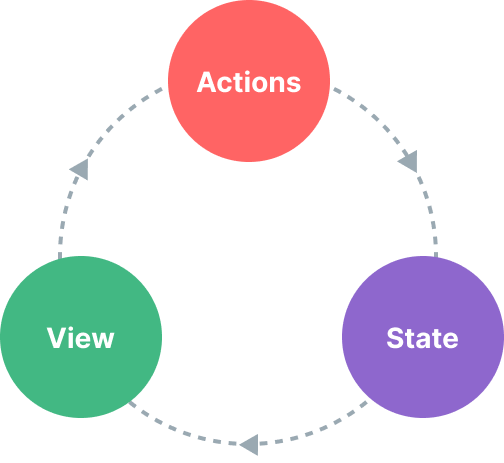

# 状态管理 {#state-management}

## 什么是状态管理？ {#what-is-state-management}

从技术上讲，每个 Rue 组件实例已经"管理"着自己的响应式状态。以一个简单的计数器组件为例：

```tsx
import { ref, type FC } from '@rue-js/rue'

export const Counter: FC = () => {
  // 状态
  const count = ref(0)

  // 动作
  const increment = () => {
    count.value++
  }

  // 视图
  return () => <div>{count.value}</div>
}
```

这是一个自包含的单元，包含以下部分：

- **状态**，驱动我们应用的事实来源；
- **视图**，**状态**的声明式映射；
- **动作**，**状态**可能根据来自**视图**的用户输入而改变的方式。

这是"单向数据流"概念的简单表示：

<p style="text-align: center">
  
</p>

然而，当我们有**多个组件共享一个公共状态**时，这种简单性开始瓦解：

1. 多个视图可能依赖于同一部分状态。
2. 来自不同视图的动作可能需要改变同一部分状态。

对于情况一，一个可能的变通方法是将共享状态"提升"到共同的祖先组件，然后作为 props 向下传递。然而，这在具有深层层次的组件树中很快就会变得繁琐，导致另一个被称为 [Prop Drilling](/guide/components/provide-inject#prop-drilling) 的问题。

对于情况二，我们经常发现自己求助于诸如通过模板 refs 直接访问父/子实例，或尝试通过触发的事件来改变和同步多个状态副本等解决方案。这两种模式都很脆弱，很快会导致无法维护的代码。

一个更简单、更直接的解决方案是将共享状态从组件中提取出来，并在全局单例中管理。这样，我们的组件树就变成了一个大的"视图"，任何组件都可以访问状态或触发动作，无论它们在树中的哪个位置！

## 使用响应式 API 进行简单的状态管理 {#simple-state-management-with-reactivity-api}

如果你有一块应该由多个实例共享的状态，你可以使用 [`reactive()`](/api/reactivity-core#reactive) 创建一个响应式对象，然后将其导入多个组件：

```ts [store.ts]
import { reactive } from '@rue-js/rue'

export const store = reactive({
  count: 0,
})
```

```tsx [ComponentA.tsx]
import { type FC } from '@rue-js/rue'
import { store } from './store'

export const ComponentA: FC = () => {
  return () => <div>来自 A：{store.count}</div>
}
```

```tsx [ComponentB.tsx]
import { type FC } from '@rue-js/rue'
import { store } from './store'

export const ComponentB: FC = () => {
  return () => <div>来自 B：{store.count}</div>
}
```

现在，每当 `store` 对象发生变化时，`<ComponentA>` 和 `<ComponentB>` 都会自动更新它们的视图——我们现在有了单一的事实来源。

然而，这也意味着任何导入 `store` 的组件都可以随意改变它：

```tsx
<button onClick={() => store.count++}>来自 B：{store.count}</button>
```

虽然这在简单情况下有效，但长期而言，任何组件都可以任意改变的全局状态并不是非常可维护的。为了确保改变状态的逻辑像状态本身一样集中，建议在 store 上定义表达动作意图的方法名：

```ts{5-7} [store.ts]
import { reactive } from '@rue-js/rue'

export const store = reactive({
  count: 0,
  increment() {
    this.count++
  }
})
```

```tsx{2}
<button onClick={() => store.increment()}>
  来自 B：{store.count}
</button>
```

:::tip
注意点击处理器使用 `store.increment()` 并带括号——这是必要的，以使用正确的 `this` 上下文调用该方法，因为它不是组件方法。
:::

虽然这里我们使用单个响应式对象作为 store，但你也可以使用其他 [响应式 API](/api/reactivity-core)（如 `ref()` 或 `computed()`）创建共享的响应式状态，甚至从 [Composable](/guide/reusability/composables) 返回全局状态：

```ts
import { ref } from '@rue-js/rue'

// 全局状态，在模块作用域中创建
const globalCount = ref(1)

export function useCount() {
  // 本地状态，每个组件创建
  const localCount = ref(1)

  return {
    globalCount,
    localCount,
  }
}
```

Rue 的响应式系统与组件模型解耦，这使其极具灵活性。

## Pinia {#pinia}

虽然我们的手动状态管理解决方案在简单场景下足够使用，但在大型生产应用中还有很多事情需要考虑：

- 更强的团队协作约定
- 与 Rue DevTools 的集成，包括时间线、组件内检查和时光旅行调试
- 热模块替换

[Pinia](https://pinia.vuejs.org) 是一个实现了上述所有功能的状态管理库。它由 Rue 核心团队维护，同时适用于 Vue 2 和 Vue 3。

现有用户可能熟悉 [Vuex](https://vuex.vuejs.org/)，Vue 之前官方的状态管理库。随着 Pinia 在生态系统中扮演同样的角色，Vuex 现在处于维护模式。它仍然可以工作，但不会再收到新功能。建议新应用使用 Pinia。

Pinia 最初是作为 Vuex 下一个迭代的探索，包含了核心团队对 Vuex 5 讨论中的许多想法。最终，我们意识到 Pinia 已经实现了我们在 Vuex 5 中想要的大部分功能，因此决定将其作为新的推荐。

与 Vuex 相比，Pinia 提供了更简单的 API，仪式更少，提供 Composition-API 风格的 API，最重要的是，与 TypeScript 一起使用时具有可靠的类型推断支持。

## 使用 Pinia 与 Rue

```ts [stores/counter.ts]
import { defineStore } from 'pinia'
import { ref, computed } from '@rue-js/rue'

export const useCounterStore = defineStore('counter', () => {
  const count = ref(0)
  const doubleCount = computed(() => count.value * 2)

  function increment() {
    count.value++
  }

  return { count, doubleCount, increment }
})
```

```tsx [Counter.tsx]
import { type FC } from '@rue-js/rue'
import { useCounterStore } from '../stores/counter'

export const Counter: FC = () => {
  const counter = useCounterStore()

  return () => (
    <div>
      <p>计数：{counter.count}</p>
      <p>双倍：{counter.doubleCount}</p>
      <button onClick={() => counter.increment()}>增加</button>
    </div>
  )
}
```

### Store 操作与异步

```ts [stores/user.ts]
import { defineStore } from 'pinia'
import { ref } from '@rue-js/rue'

export const useUserStore = defineStore('user', () => {
  const user = ref(null)
  const loading = ref(false)
  const error = ref(null)

  async function fetchUser(id: string) {
    loading.value = true
    error.value = null

    try {
      const response = await fetch(`/api/users/${id}`)
      user.value = await response.json()
    } catch (e) {
      error.value = e
    } finally {
      loading.value = false
    }
  }

  return { user, loading, error, fetchUser }
})
```
